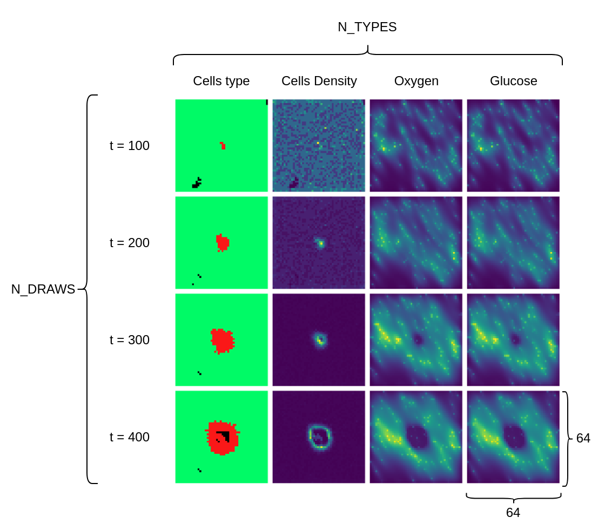

# Parameter identification of tumour model
Identification of biological parameters of a tumour model for adaptive radiotherapy

## Description
For context, this project follows two others done by [Florian Martin](https://github.com/martinflor/RL_for_radiotherapy_treatment/tree/main) and [Gregoire Moreau](https://github.com/gregoire-moreau/radio_rl) that aims 
to use reinforcement learning (RL) to optimize radiotherapy treatments on a tumour model.
In order to better adapt the treatment to a specific person in real time, our purpose is to retrieve the starting parameter based on simulation outputs.
The output can vary both in type and in time as shown in this image:

We use a neural network composed of convolution layers and long-short term memory (LSTM) blocks to predict the biological parameters.

## Features
- [x] Dataset generation (See [Datasets](datasets/README.md))
- [x] Deep learning model (See [Networks](networks/README.md))
- [x] Inherent difference in simulation outputs (See the jupyter notebook in the `simulation_similarity_analysis` directory)
- [x] Graphical interface to interact with the different model
- [ ] Try to predict others parameters (cell_cycle only)
- [ ] Improve performance

## Usage
Evaluate the model and the dataset:
```bash
python3 main.py -config config.yaml -train
```
- The parameter `config.yaml` is stored in the `configurations` folder and describes the dataset used, the deep learning model and the training parameters (See [Configuration](configurations/README.md))
- The parameter `-train` is optional and can be used to train the model

Graphical interface to show the already trained model and to train more:
```bash
python3 graphical_interface.py
```
## Results
(See [Results](results/README.md)) 
## Dependencies
See ```requirements.txt```

## License
[EPL]()
