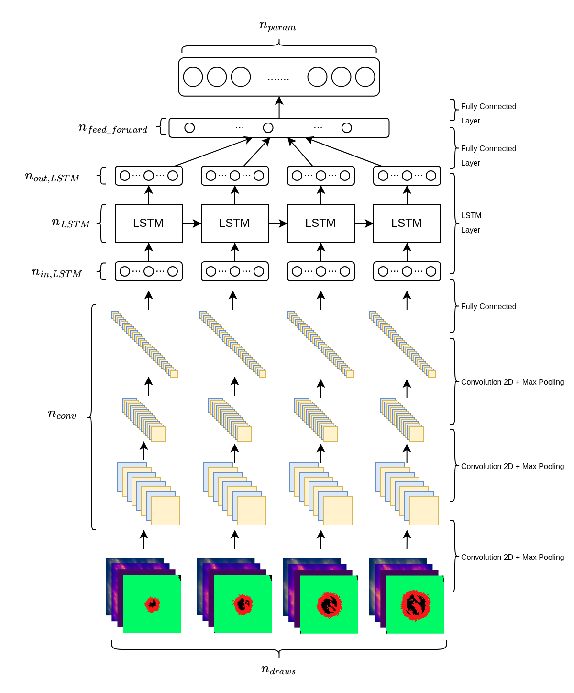

# Networks
This directory contains the core of the model:
- `dataLoader.py`: This file contains a class that implement the pytorch default _Dataset_ class. It retrieves 
all images in the datasets directory and arrange them for the training.
- `model.py`: This file contains a class that describes the instantiation, the training and the evaluation of the model
- `architecture.py`: This file contains the architecture of the neural network.
- `early_stopping`: This file contains a class describing the early stopping used.
The architecture is very modular but a schematic of it is shown here:
